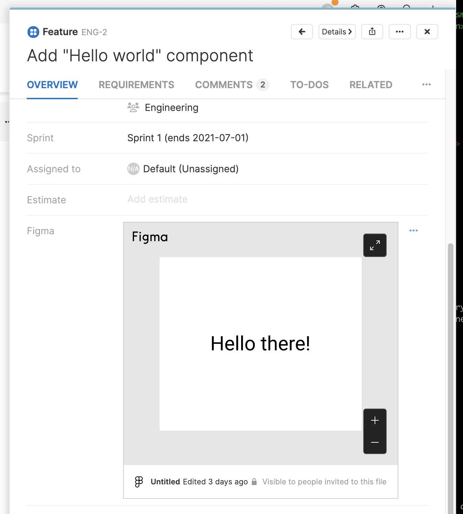

# figma

This [Aha! Develop](https://www.aha.io/develop/overview) extension allows you to embed your Figma designs into Aha!.

It provides these contributions:

- `Figma attribute` - Link a Figma design to a record in Aha! to see a live preview of the design.

## Demo



## Installing the extension

**Note: In order to install an extension into your Aha! Develop account, you must be an account administrator.**

Install the figma extension by clicking [here](https://secure.aha.io/settings/account/extensions/install?url=https%3A%2F%2Fgithub.com%2Faha-develop%2Ffigma%2Freleases%2Fdownload%2F1.0.0%2Faha-develop.figma-v1.0.0.gz).


## Working on the extension

Install `aha-cli`:

```sh
 npm install -g aha-cli
```

Clone the repo:

```sh
git clone https://github.com/aha-develop/figma.git
```

**Note: In order to install an extension into your Aha! Develop account, you must be an account administrator.**

Install the extension into Aha! and set up a watcher:

```sh
aha extension:install
aha extension:watch
```

Now, any change you make inside your working copy will automatically take effect in your Aha! account.

When you are finished working on your extension, build it so that others can install it through its URL:

```sh
aha extension:build
```

To learn more about developing Aha! Develop extensions, including the API reference, the full documentation is located here: [Aha! Develop Extension API]()
